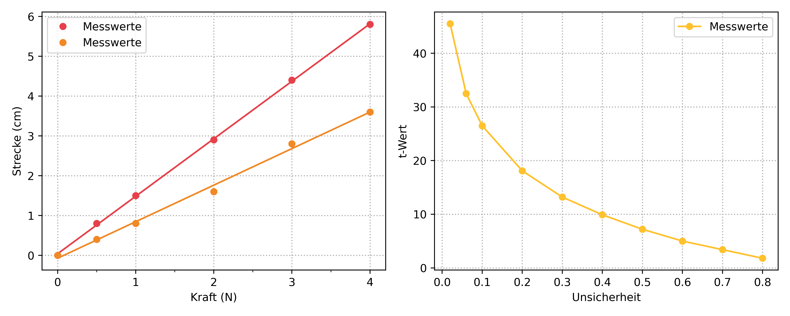
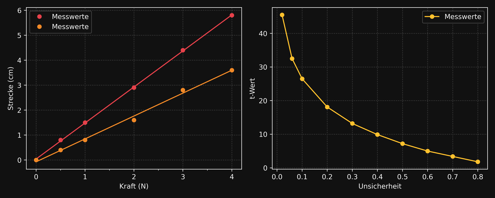

<h1 align="center">📊 Collection of Plotting Templates</h1>

<h4 align="center">A curated collection of reusable Matplotlib templates and custom styles for clean, consistent data visualizations.</h4>

<p align="center">
  <a href="https://github.com/TheBaronBlood/Collection-Of-Plotting-Templates/commits/main">
    
  </a>
  <a href="https://github.com/TheBaronBlood/Collection-Of-Plotting-Templates/issues">
    
  </a>
  
  
  
</p>

<p align="center">
  <a href="#structure">Structure</a> •
  <a href="#styles">Styles</a> •
  <a href="#templates">Templates</a> •
  <a href="#setup">Setup</a> •
  <a href="#contributing">Contributing</a> •
  <a href="#license">License</a>
</p>

---

<table>
<tr>
<td>

**Collection of Plotting Templates** is a shared repository of _ready-to-use_ **Matplotlib plot templates** and **custom style files** — designed for fast, consistent, and beautiful data visualizations.

It comes with two polished themes (**light** and **dark**), a reusable template structure, and a `Styles` package that auto-registers all styles on import — no configuration needed.

</td>
</tr>
</table>

---

## Structure

```
Collection-Of-Plotting-Templates/
├── Styles/                  # Custom Matplotlib style package
│   ├── __init__.py          # Auto-registers styles on import
│   ├── mylight.mplstyle     # Light theme
│   └── mydark.mplstyle      # Dark theme
├── Templates/               # Ready-to-use plot templates
│   ├── ADT/
│   │   └── U-I-Diagram.py
│   └── .../
├── Output/                  # Generated plots (git-ignored)
├── pyproject.toml
└── .gitignore
```

## Styles

The `Styles` package provides two themes that register automatically on import.

### Usage

```python
import Styles
import matplotlib.pyplot as plt

plt.style.use("mylight")  # or "mydark"
```

### Preview

| `mylight` | `mydark` |
|:---------:|:--------:|
| ** | ** |

> Add screenshots by saving example plots to `Styles/preview/` and linking them above with ``.

## Templates

Each template is a self-contained, ready-to-run script. Copy it, swap in your data, done.

| Template | Category | Description |
|----------|----------|-------------|
| `U-I-Diagram.py` | ADT | Voltage–Current diagram with markers and legend |
| *(more coming)* | | |

### Template Structure

```python
import Styles
import matplotlib.pyplot as plt

# ── Theme ────────────────────────────────────────────────────────────────────
plt.style.use("mylight")
colors = plt.rcParams["axes.prop_cycle"].by_key()["color"]

# ── Figure & Axes ─────────────────────────────────────────────────────────────
fig, ax = plt.subplots(figsize=(10, 6))

# ── Data ─────────────────────────────────────────────────────────────────────
x = ...
y = ...

# ── Plot ─────────────────────────────────────────────────────────────────────
ax.plot(x, y, label="...")

# ── Labels ───────────────────────────────────────────────────────────────────
ax.set_xlabel("x")
ax.set_ylabel("y")
ax.set_title("Title")

ax.legend()
fig.tight_layout()
plt.show()
```

## Setup

##### 1. Clone the repository
```bash
git clone https://github.com/TheBaronBlood/Collection-Of-Plotting-Templates.git
cd Collection-Of-Plotting-Templates
```

##### 2. Create a virtual environment
```bash
python -m venv .venv
source .venv/bin/activate        # macOS / Linux
.venv\Scripts\activate           # Windows
```

##### 3. Install dependencies
```bash
pip install matplotlib numpy pandas
```

##### 4. Register the Styles package

So that `import Styles` works from any script in the project, add the root path to your environment:

```bash
# macOS / Linux
echo "/absolute/path/to/Collection-Of-Plotting-Templates" > .venv/lib/pythonX.X/site-packages/myproject.pth

# Windows
echo D:\path\to\Collection-Of-Plotting-Templates > .venv\Lib\site-packages\myproject.pth
```

> [!NOTE]
> **PyCharm** handles this automatically. **VS Code** requires the `.pth` file above.

> [!TIP]
> Replace `pythonX.X` with your actual Python version, e.g. `python3.14`.

## Contributing

Got a template you'd like to share? Follow these steps:

1. Add your script to the appropriate subfolder under `Templates/`
2. Follow the existing template structure
3. Use [Conventional Commits](https://www.conventionalcommits.org/):
   - `feat: add new plot template`
   - `style: update mylight theme`
   - `fix: correct axis label`
   - `refactor: rename folder`
4. Do **not** commit files from `Output/` — they are git-ignored

## License

[](LICENSE)
