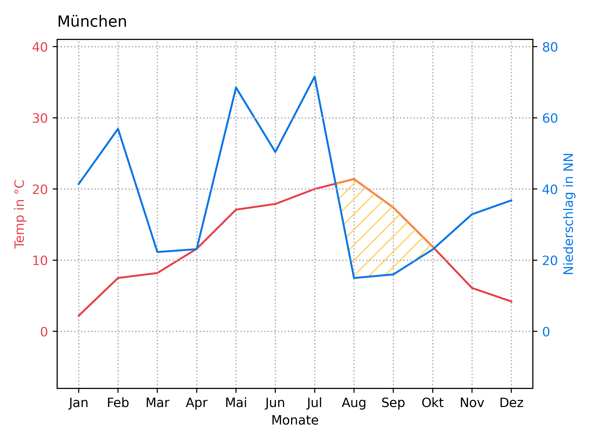
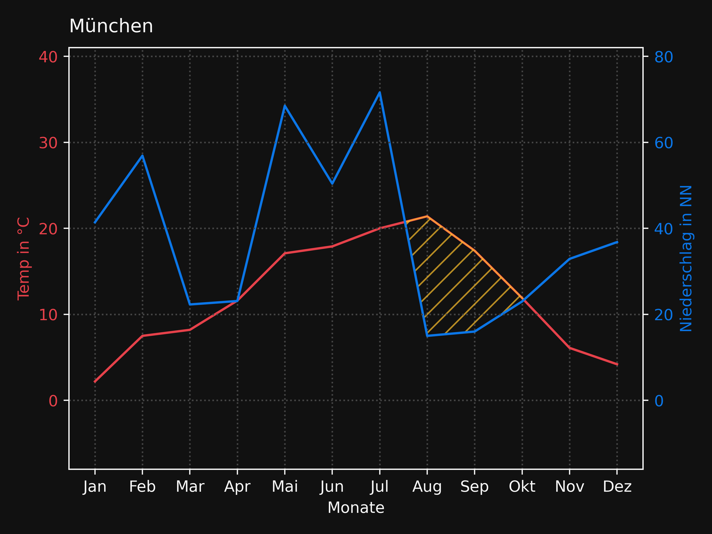
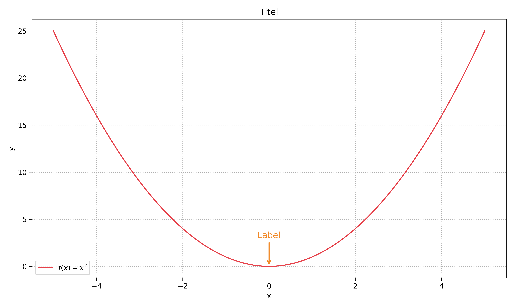
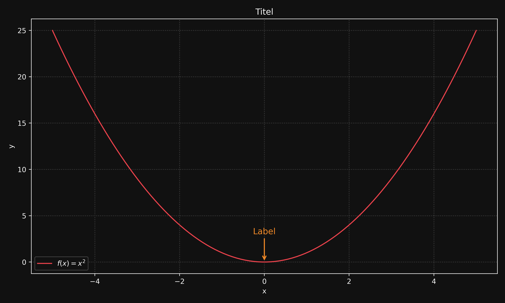

<h1 align="center">📊 Collection of Plotting Templates</h1>

<h4 align="center">A curated collection of reusable Matplotlib templates and custom styles for clean, consistent data visualizations.</h4>

<p align="center">
  <a href="https://github.com/TheBaronBlood/Collection-Of-Plotting-Templates/commits/main">
    
  </a>
  <a href="https://github.com/TheBaronBlood/Collection-Of-Plotting-Templates/issues">
    
  </a>
  
  
  
</p>

<p align="center">
  <a href="#structure">Structure</a> •
  <a href="#styles">Styles</a> •
  <a href="#templates">Templates</a> •
  <a href="#setup">Setup</a> •
  <a href="#contributing">Contributing</a> •
  <a href="#license">License</a>
</p>

---

<table>
<tr>
<td>

---

## Structure

```
Collection-Of-Plotting-Templates/
├── Styles/                  # Custom Matplotlib style package
│   ├── __init__.py          # Auto-registers styles on import
│   ├── mylight.mplstyle     # Light theme
│   └── mydark.mplstyle      # Dark theme
├── Templates/               # Ready-to-use plot templates
│   ├── ADT/
│   │   └── U-I-Diagram.py
│   └── .../
├── Output/                  # Generated plots (git-ignored)
├── pyproject.toml
└── .gitignore
```

## Styles

The `Styles` package provides two themes that register automatically on import.

### Usage

```python
import Styles
import matplotlib.pyplot as plt

plt.style.use("mylight")  # or "mydark"
```

### Preview

<div align="center">

| mylight | mydark |
| :---: | :---: |
|  |  |
|  |  |
|  |  |

</div>

## Templates

Each template is a self-contained, ready-to-run script. Copy it, swap in your data, done.

| Template         | Category | Description                                      |
| ---------------- | -------- | ------------------------------------------------ |
| `U-I-Diagram.py` | ADT      | Voltage–Current diagram with markers and legend |
| *(more coming)*  |          |                                                  |

### Template Structure

```python
import Styles
import matplotlib.pyplot as plt

# ── Theme ────────────────────────────────────────────────────────────────────
plt.style.use("mylight")
colors = plt.rcParams["axes.prop_cycle"].by_key()["color"]

# ── Figure & Axes ─────────────────────────────────────────────────────────────
fig, ax = plt.subplots(figsize=(10, 6))

# ── Data ─────────────────────────────────────────────────────────────────────
x = ...
y = ...

# ── Plot ─────────────────────────────────────────────────────────────────────
ax.plot(x, y, label="...")

# ── Labels ───────────────────────────────────────────────────────────────────
ax.set_xlabel("x")
ax.set_ylabel("y")
ax.set_title("Title")

ax.legend()
fig.tight_layout()
plt.show()
```

## Setup

##### 1. Clone the repository

```bash
git clone https://github.com/TheBaronBlood/Collection-Of-Plotting-Templates.git
cd Collection-Of-Plotting-Templates
```

##### 2. Create a virtual environment

```bash
python -m venv .venv
source .venv/bin/activate        # macOS / Linux
.venv\Scripts\activate           # Windows
```

##### 3. Install dependencies

```bash
pip install matplotlib numpy pandas
```

##### 4. Register the Styles package

So that `import Styles` works from any script in the project, add the root path to your environment:

<details>
<summary>Windows</summary>

1. create a `project.toml` in the root dir
  
```toml
[build-system]
requires = ["setuptools>=68.0", "wheel"]
build-backend = "setuptools.build_meta"

[project]
name = "Styles"
version = "0.1.0"
description = "A collection of matplotlib styles"
requires-python = ">=3.8"
dependencies = [
    "matplotlib>=3.0.0",
    "numpy>=1.20.0",
]
  
[tool.setuptools]
packages = ["Styles"]
  
[tool.setuptools.package-data]
Styles = ["*.mplstyle"]
```
  
2. build the Style Package
  
```terminal
pip install -e .
```
> Important
> make sure your terminal is in the right .venv 
> ```terminal
> (.venv) PS C:\absolute\path\Collection-Of-Plotting-Templates> pip install -e .
> ```

3. now it shoud works

> Tip
> you can now deleate all create folders `Styles.egg-info` and the toml `project.toml`

</details>
<details>
<summary>MacOS / Linux</summary>
  
```bash
echo "/absolute/path/to/Collection-Of-Plotting-Templates" > .venv/lib/pythonX.X/site-packages/myproject.pth
```
</details>


> [!NOTE]
> **PyCharm** handles this automatically. **VS Code** requires the `.pth` file above.

> [!TIP]
> Replace `pythonX.X` with your actual Python version, e.g. `python3.14`.

## Contributing

Got a template you'd like to share? Follow these steps:

1. Add your script to the appropriate subfolder under `Templates/`
2. Follow the existing template structure
3. Use [Conventional Commits](https://www.conventionalcommits.org/):
   - `feat: add new plot template`
   - `style: update mylight theme`
   - `fix: correct axis label`
   - `refactor: rename folder`
4. Do **not** commit files from `Output/` — they are git-ignored

## License

[](LICENSE)

